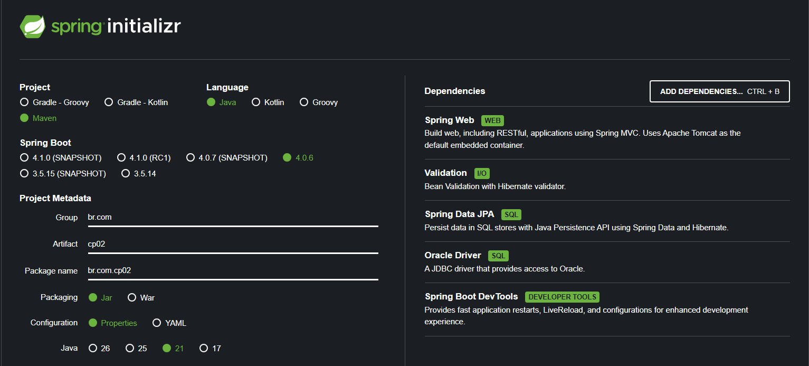
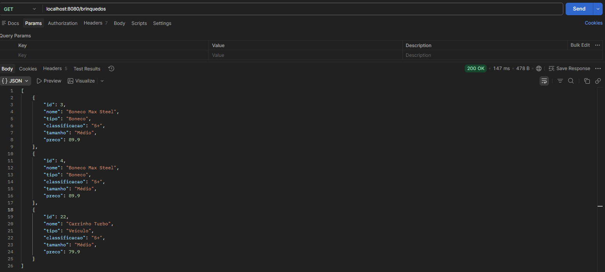
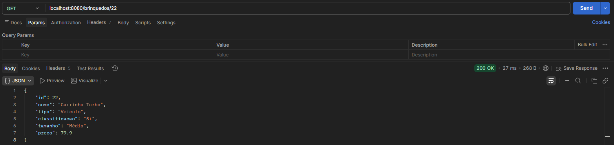
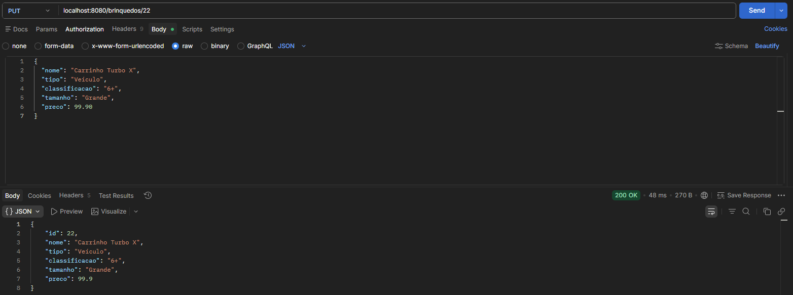
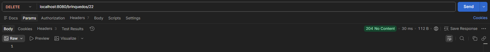

# API de Brinquedos - Spring Boot CRUD

Projeto desenvolvido em Java utilizando Spring Boot, Maven, JPA/Hibernate e Oracle Database para gerenciamento de brinquedos infantis através de operações CRUD (Create, Read, Update e Delete).

## Objetivo

A aplicação permite cadastrar, consultar, atualizar e remover brinquedos de um banco de dados Oracle através de endpoints REST testados no Postman ou Insomnia.

---

# Tecnologias Utilizadas

- Java
- Spring Boot
- Maven
- Spring Data JPA
- Hibernate
- Oracle Database
- Postman
- IntelliJ IDEA

---

# Configuração Spring Initializr



---

# Estrutura do Projeto

O projeto foi desenvolvido seguindo a arquitetura em camadas:

- Controller → Responsável pelos endpoints REST
- Service → Regras de negócio
- Repository → Comunicação com banco de dados
- Entity → Representação da tabela no banco
- DTO → Transferência de dados

---

# Banco de Dados

Tabela utilizada no Oracle Database:

```sql
CREATE TABLE TDS_TB_BRINQUEDOS (
    ID NUMBER PRIMARY KEY,
    CLASSIFICACAO VARCHAR2(255),
    NOME VARCHAR2(255),
    PRECO BINARY_DOUBLE,
    TAMANHO VARCHAR2(255),
    TIPO VARCHAR2(255)
);
```

---

# Endpoints da API

Base URL:

```http
http://localhost:8080/brinquedos
```

---

# CREATE - Cadastrar Brinquedo

## Endpoint

```http
POST /brinquedos
```

## JSON de Envio

```json
{
  "nome": "Carrinho Turbo",
  "tipo": "Veículo",
  "classificacao": "5+",
  "tamanho": "Médio",
  "preco": 79.90
}
```

## Resposta Esperada


---

# READ - Listar Todos os Brinquedos

## Endpoint

```http
GET /brinquedos
```

## Resposta Esperada



---

# READ BY ID - Buscar Brinquedo por ID

## Endpoint

```http
GET /brinquedos/22
```

## Resposta Esperada



---

# UPDATE - Atualizar Brinquedo

## Endpoint

```http
PUT /brinquedos/22
```

## JSON de Envio

```json
{
  "nome": "Carrinho Turbo X",
  "tipo": "Veículo",
  "classificacao": "6+",
  "tamanho": "Grande",
  "preco": 99.90
}
```

## Resposta Esperada



---

# DELETE - Remover Brinquedo

## Endpoint

```http
DELETE /brinquedos/22
```

## Resposta Esperada



---

# Testes no Postman

Os testes dos endpoints foram realizados utilizando o Postman através do endereço:

```http
http://localhost:8080
```

Foram testadas todas as operações CRUD:
- Cadastro de brinquedos
- Consulta de todos os brinquedos
- Consulta por ID
- Atualização de dados
- Exclusão de registros

---

# Como Executar o Projeto

## 1. Executar a aplicação

Executar a classe principal Spring Boot.

## 2. Testar no Postman

Utilizar os endpoints documentados acima.
